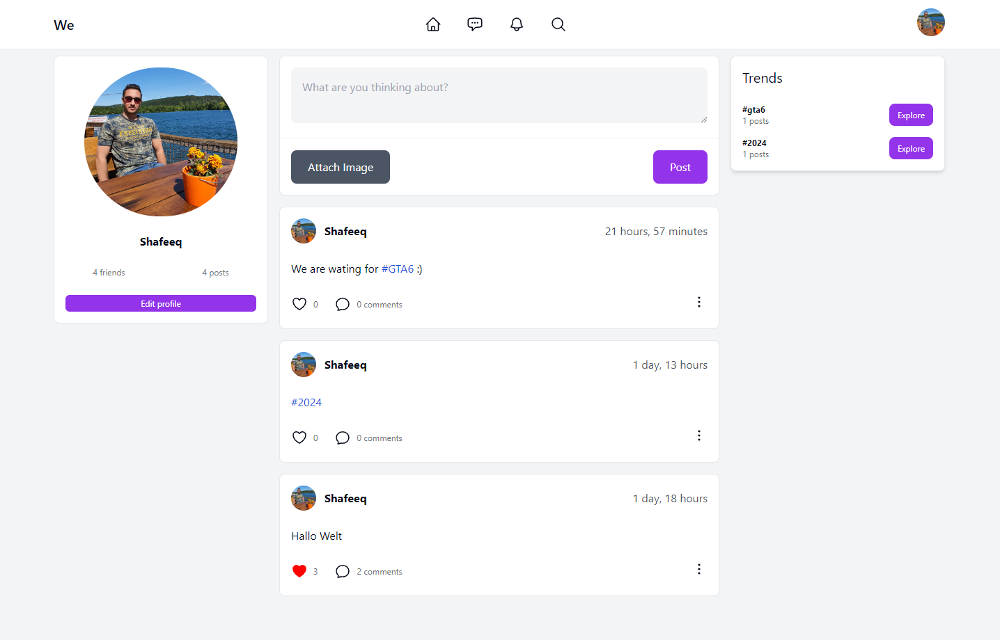
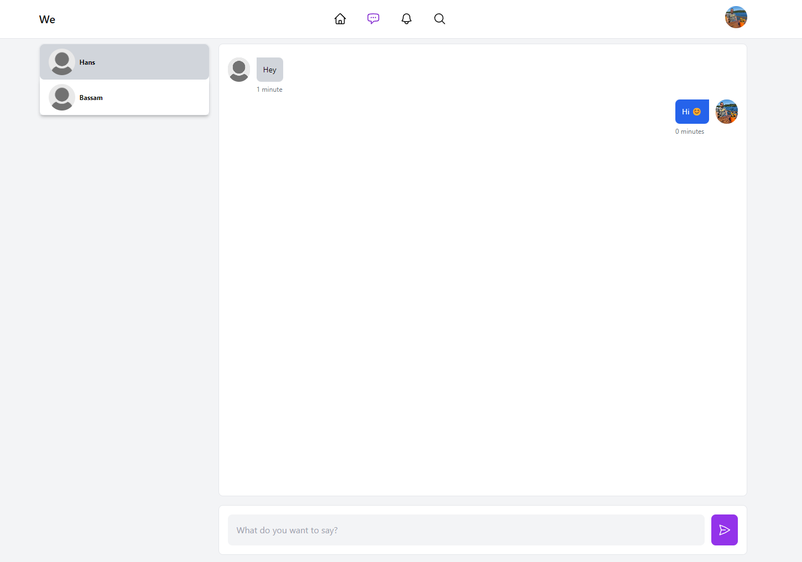

# We Social Network
Welcome to We, a vibrant social network designed for sharing news and fostering new connections. Whether you're looking to stay informed or expand your social circle, We has you covered. Sign in or create an account today to join our community!

This project serves as a practical application for learning Python Django, showcasing a range of real-world features and functionalities. Our frontend is crafted using the latest technologies, including Vue.js 3 and Tailwind CSS, ensuring a seamless and dynamic user experience

## ToDo List
- [ ] Implement Real-time Chatting
- [ ] Implement Infinite Scroll in Chats
- [ ] Implement private posting functionality
- [ ] Add "Forgot password" option
- [ ] Implement dark mode
- [ ] Write Unit Tests
- [ ] Turn the Vue Web App into a Progressive Web App (PWA)


## Live
https://we-social-network.web.app/

## 📸 Screenshots




## Config
You have to create a virtual environment for the backend and install all dependencies.

## Deploy
Backend: You have to use a Python hosting service. I personally prefer www.pythonanywhere.com.
Frontend: You only need to add your web app's Firebase configuration to `./frontend/src/firebase.ts` and provide your server URL in `./frontend/.env`.


## Build Setup for Backend
```bash
# Python backend setup
cd backend/

# Create a virtual environment
python -m venv venv

# Activate the virtual environment (for Windows)
venv\Scripts\activate

# Activate the virtual environment (for MacOS/Linux)
source venv/bin/activate

# Install backend dependencies
pip install -r requirements.txt
```

## Build Setup for Frontend
```bash
# Install frontend dependencies
npm install

# Serve with hot reload at localhost:8080
npm run dev

# Build for production with minification
npm run build

# Build & deploy on Firebase
npm run deploy

```
